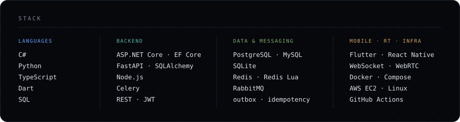

  

 

**I write backend systems. Every number on this page is one I measured myself.**

I have eight patches merged into projects I had never worked on before: CERN's **ROOT**, the
**.NET runtime**, **systemd**, **Apache Airflow** and the **VS Code** docs. I went looking for the
bugs, wrote the fixes, and defended them to maintainers who had no idea who I was.

The project I put most of my time into is a pre-accounting and logistics program. It has real users
already and I am still building it — right now I am closing the gaps that only showed up once it
met real data. I also write mobile apps in Flutter and React Native. And I built a watch-party
engine where the browsers send video to each other peer to peer over a WebRTC mesh and the server
only introduces them; when I put a second instance behind it, p95 dropped from 258 ms to 14 ms.

**I am looking for an internship or a junior backend position.**

### Measured, not asserted

| The claim | What the number says |
|---|---|
| A seat cannot be sold twice | 20 concurrent requests, one seat → **1 sale, 19 × 409**, one held seat in the database |
| It scales horizontally | 2,500 connections → p95 **258 ms** on one instance, **14 ms** on two |
| Course capacity holds under load | 15 applications, capacity 5 → old logic enrolled **15**, current logic enrolls **5** |
| Route ordering is worth having | 10 real stops in Kadıköy → **44.3 km** as entered, **14.6 km** reordered |
| The tests actually run | **285** passing across my repositories, on every push |

 

## Projects

<table>
  <tr>
    <td width="50%"></td>
    <td width="50%"></td>
  </tr>
  <tr>
    <td width="50%"></td>
    <td width="50%"></td>
  </tr>
  <tr>
    <td width="50%"></td>
    <td width="50%"></td>
  </tr>
  <tr>
    <td width="50%"></td>
    <td width="50%"></td>
  </tr>
</table>

Anything marked <b>PRIVATE</b> — a card above or a row below — links to a repository that is not
open to visitors. Happy to walk through any of them in an interview.

### Also built

| | |
|---|---|
| [Coffee Shop Management](https://github.com/kutsibalci/Small-coffee-Shop-Management-App) | Windows Forms till for a small café. Making the ordering logic testable is how I found that two waiters could open two tabs on one table and only one got billed. |
| [Sefer Defteri](https://github.com/kutsibalci/sefer-defteri) PRIVATE | The driver's side of the accounting system. Expo, on-device SQLite, document expiry reminders. Works with no signal in a truck cab. |
| [Minik Masal](https://github.com/kutsibalci/minik-masal) PRIVATE | Audio story player for small children, with a parent gate. Written twice: Flutter and Expo. |
| [Business Directory API](https://github.com/kutsibalci/business-directory-api) PRIVATE | FastAPI service collecting business listings by province. Paginated endpoints, Alembic migrations, spreadsheet export. |
| [Redmine Deployment](https://github.com/kutsibalci/Redmine-Upgrade) PRIVATE | Dockerised Redmine with PostgreSQL on AWS EC2. Built with [@hzflora](https://github.com/hzflora). |
| [Pansuman Simulator](https://github.com/kutsibalci/PansumanSimulator) PRIVATE | Unity training simulator for wound dressing. In progress. |

 

## Open source

Eight patches merged into projects I had no prior connection to. The pattern is the same each time:
I sweep for a class of defect, throw away almost everything the sweep returns, and open a pull
request only for what I can prove.

| Merged | What it was |
|---|---|
| [root#23002](https://github.com/root-project/root/pull/23002) | A TMVA header unreachable since 2015. I traced the commit that orphaned it and checked every symbol it declared was already covered elsewhere. |
| [root#23004](https://github.com/root-project/root/pull/23004) | Two aggregate LinkDef headers that lost their only caller when the build went back to two dictionaries per package. |
| [systemd#43300](https://github.com/systemd/systemd/pull/43300) | Seven man page cross-references pointing at the wrong section. CI went red; I pulled the 5.4 MB log, showed the failure was an unrelated ppc64le timeout, and said so. Merged with the job still red. |
| [airflow#71179](https://github.com/apache/airflow/pull/71179) | Twenty links that 404 for every reader but open fine for every author. The directory is a git symlink blob and GitHub will not traverse one. 372 candidates went in, 20 came out. |
| [vscode-docs#10119](https://github.com/microsoft/vscode-docs/pull/10119) | Three setting IDs whose casing does not match what VS Code registers, so they resolve to settings that do not exist. I checked all 771 IDs behind 1,760 macros. |
| [dotnet/runtime#131865](https://github.com/dotnet/runtime/pull/131865) | Eight documentation links whose targets exist but whose relative paths resolve nowhere. From thirty-nine candidates. |
| [rustc_codegen_gcc#945](https://github.com/rust-lang/rustc_codegen_gcc/pull/945) | Two broken links. The useful part was working out I was in the wrong repository: it is a subtree, so a fix landed upstream would be overwritten on the next sync. |
| [eclipse-score/communication#853](https://github.com/eclipse-score/communication/pull/853) | Four links in the design docs of the BMW/Bosch/Mercedes automotive platform. One image URL was written `hhttp://`, so a diagram had never rendered. |

One more worth mentioning: [root#23036](https://github.com/root-project/root/issues/23036) was a
report, not a patch. Three settings shipped in `system.rootrc` that nothing in ROOT reads. Whether
to delete them or wire them up was a maintainer's call, so I filed both options. The engineer who
wrote that subsystem replied *"Yes, some parameters were not cleaned up"*, opened the fix half an
hour later, and it merged. No commit under my name, which for that kind of finding is the honest
outcome.

 

## Stack

  

 

---

**[balcihkutsi@gmail.com](mailto:balcihkutsi@gmail.com)** · **[LinkedIn](https://www.linkedin.com/in/h%C3%BCseyinkutsibalci/)**

İzmir, Türkiye · open to remote and hybrid

