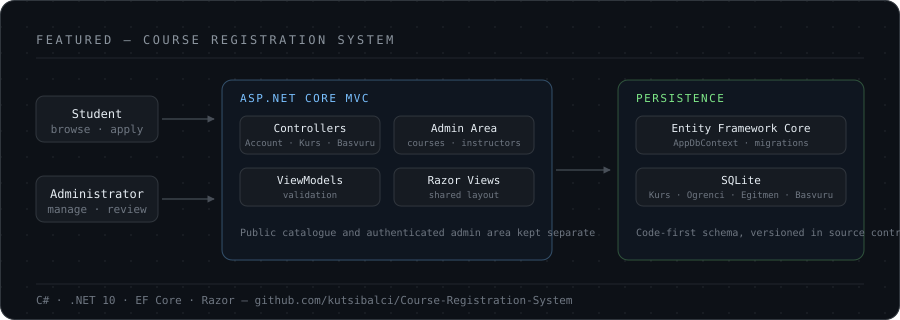
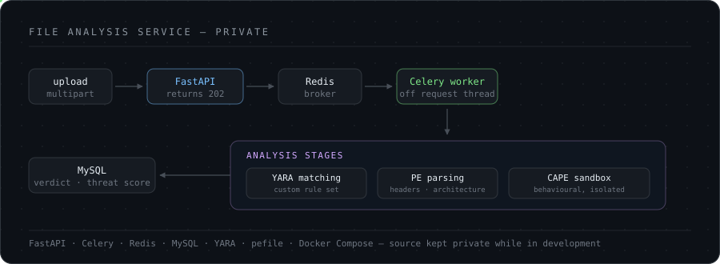
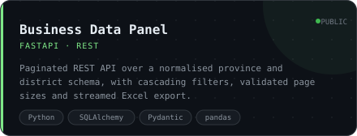
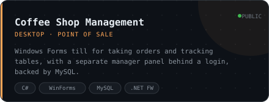
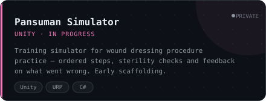

<div align="center">
  
</div>

<br>

Backend development student at **Anadolu University**, based in **İzmir, Türkiye**.
I build server-side systems end to end — schema first, then the API, then the container
it ships in.

Most of what is here started as something I wanted to understand rather than something I
was told to build: how an ORM actually maps a schema, what a request touches between the
route and the database, what it takes to run a service on a server instead of a laptop.

**Open to internships, junior backend roles and open-source collaboration.**

<br>

## Open Source

Eight contributions merged into projects I had no prior connection to — two into
**[CERN's ROOT](https://root.cern)**, and one each into
**[.NET runtime](https://github.com/dotnet/runtime)**, the Rust project's
**[GCC codegen backend](https://github.com/rust-lang/rustc_codegen_gcc)**,
**[systemd](https://github.com/systemd/systemd)**,
**[Eclipse S-CORE](https://github.com/eclipse-score)**,
**[Apache Airflow](https://github.com/apache/airflow)** and
**[the VS Code documentation](https://github.com/microsoft/vscode-docs)**.

**[root-project/root#23002](https://github.com/root-project/root/pull/23002)** — `tmva/tmva/inc/LinkDef5.h`
had been unreachable since 2015. The commit that split TMVA into `libTMVA` and `libTMVAGui` dropped that
file's `#include` from the master LinkDef but left the file itself in the tree, and two later maintenance
sweeps edited it without noticing it was already dead. I traced the commit that orphaned it, checked that
every symbol it declared was already covered by the module that actually owns those classes, and confirmed
against the generated build graph that nothing referenced it — then proposed the removal.

**[root-project/root#23004](https://github.com/root-project/root/pull/23004)** — the same shape once I knew
to look for it. `math/smatrix/inc/LinkDefAll.h` and `math/genvector/inc/Math/LinkDef_GenVectorAll.h` exist
only to `#include` the two real LinkDefs of their package, from a time when each package built one combined
dictionary. The build has since gone back to two dictionaries per package, each naming its own LinkDef
directly, so the aggregates lost their only caller. Neither name appears in any `CMakeLists.txt` or `.cmake`
file, no other LinkDef includes them, and `ROOT_INSTALL_HEADERS` excludes LinkDef headers from the install,
so they are not reachable from outside the repository either. One commit per module, because the two are
independently revertable.

**[dotnet/runtime#131865](https://github.com/dotnet/runtime/pull/131865)** — eight documentation links whose
targets exist but whose relative paths resolve nowhere. The one I liked was in the datacontracts design docs:
they link to `contract_descriptor.md` while the file is `contract-descriptor.md`, and the same document links
to it *correctly* twice elsewhere. So it was an inconsistency inside one file rather than a rename nobody
finished. Another was written with Windows backslashes. The repository has no markdown link checker in CI,
which is why they rotted quietly.

**[rust-lang/rustc_codegen_gcc#945](https://github.com/rust-lang/rustc_codegen_gcc/pull/945)** — I found these
while sweeping `rust-lang/rust`, and the useful part was working out that I was in the wrong repository.
`compiler/rustc_codegen_gcc` is a subtree synced *from* its own project, so a fix landed upstream would have
been overwritten on the next sync. One link pointed at `./doc/gimple.md` from a file already inside `doc/`.
The other pointed at a file deleted a year earlier; I traced the commit that removed it and found the content
had survived inside a broader `debugging.md`, so the entry could be repointed instead of dropped.

**[systemd/systemd#43300](https://github.com/systemd/systemd/pull/43300)** — seven cross-references naming a
man page that exists but giving a section it is not installed in, so `man` sends the reader to the wrong
place. I resolved every `<citerefentry>` in `man/` against `man/rules/meson.build`, which is generated and is
therefore the authoritative list of what ships, and reported only references whose target *is* shipped under a
different section — the section is a fact, not a judgement. The part I would defend in review is what happened
next: CI went red. Rather than call it flaky, I pulled the 5.4 MB job log and found `test-fiber` timing out on
ppc64le with `Ok: 1779, Fail: 0` — nothing failed, one thing did not finish, and a change to six XML files
cannot reach it. I said so, and said plainly that I could find no prior report of that timeout. Two core
maintainers merged it hours later, with the job still red.

**[eclipse-score/communication#853](https://github.com/eclipse-score/communication/pull/853)** — four links in
the design docs of the BMW/Bosch/Mercedes automotive platform. Three used one `../` too many; one image URL
was written `hhttp://`, so a PlantUML diagram had never rendered. The sibling diagram in the same file already
used the correct form, which is what turned a guess into a check.

**[apache/airflow#71179](https://github.com/apache/airflow/pull/71179)** — twenty links in the translation
guide that 404 for every reader while opening fine for every author. The `i18n` README lives under a
directory that Git stores as a **symlink blob**, and GitHub will not traverse one: clone the repository and
the paths resolve, browse it on the web and they do not. That is why nobody had noticed. Three hundred and
seventy-two candidates went in; twenty came out.

**[microsoft/vscode-docs#10119](https://github.com/microsoft/vscode-docs/pull/10119)** — three `setting(...)`
macros naming a setting ID that VS Code does not register, because the casing is wrong: the docs write
`chat.mcp.autoStart` and `Microsoft-sovereign-cloud.environment`, the product registers both in lowercase.
`ConfigurationRegistry` indexes settings in a plain record keyed by the exact ID string, so a differently-cased
key is not the same setting spelled differently — it is an unregistered one. Pasting the documented ID into
`settings.json` gets you the *Unknown Configuration Setting* marker and no behaviour, and on the rendered page
the macro becomes an interactive control that carries the bad ID verbatim. What made it a check rather than a
guess: the four sibling `chat.mcp.*` rows in the same table match the source exactly, and the default shown in
the offending row matches the real setting's enum — so the row describes the right setting and only the ID is
misspelled. I resolved all 771 distinct IDs behind the repository's 1,760 macros against what
`microsoft/vscode` actually registers, which needed two traps handled first: editor settings never appear as a
full literal, so `editor.overtypeCursorStyle` is assembled from an `EditorOption` name and reads as missing to
a naive sweep; and GitHub code search is token-based, so searching `chat.mcp.autoStart` happily matches
`chat.mcp.autostart` and cannot settle a casing question at all. The comparison had to run locally against a
case-sensitive index. A fourth instance lives in release notes for a shipped version, which are a dated record
rather than a document to correct, so I left it alone and said so.

Not every finding should be a pull request.
**[root-project/root#23036](https://github.com/root-project/root/issues/23036)** — `system.rootrc` ships
three settings that nothing in ROOT reads. `WebGui.HttpLoopback` is documented in *two* places while
loopback binding is actually controlled by a file-static variable reachable only from C++; the corroboration
was that in the block where it should have been read, it is the only value not taken from `gEnv` — the six
around it are. Whether each should be deleted or wired up is a maintainer's call, so I filed both directions
rather than picking one. Sergey Linev, who wrote the web GUI, replied *"Yes, some parameters were not cleaned
up"*, opened the fix half an hour later, and it merged with two core approvals. No commit under my name — a
confirmed report instead, which for that class of finding is the honest outcome.

The two I am most interested in are not documentation.

**[apache/kafka#23098](https://github.com/apache/kafka/pull/23098)** — `TokenInformation`, the delegation-token
class, compares six fields in `equals()` and hashes seven in `hashCode()`. The extra one is `expiryTimestamp`,
which `equals()` leaves out on purpose: renewing a token does not make it a different token. So two instances
can be equal and hash differently, which is the one thing `Object.hashCode` forbids — `HashSet` keeps both,
`HashMap.get` returns null. It is also the class's only non-final field and has a public setter, so an
instance's hash changes while it sits in a collection. I walked all 500 classes in Kafka's main source that
declare both methods; this is the only one where `hashCode` reads a field `equals` ignores. The test I added
fails three of its four cases on trunk and passes with the fix.

**[eclipse-score/baselibs#444](https://github.com/eclipse-score/baselibs/pull/444)** — placement `new` over a
live member without ending its lifetime, in ISO 26262 ASIL-B code. The issue listed three sites; a sweep found
six. I did *not* apply the fix the reporter proposed — `static_assert`s showed `score::Result<Value>` is
move-constructible but not move-assignable for the non-assignable types the code exists to support, so their
suggestion would not compile. The placement `new` is a deliberate workaround; only the lifetime was wrong.
Assigned to me by an ETAS
(Bosch) engineer and queued for review by a five-person panel that includes two from BMW.

Also open: [sixteen links in NVIDIA/CUTLASS](https://github.com/NVIDIA/cutlass/pull/3436) left behind by a
docs reorganisation; [a trace record in Eclipse S-CORE's
logger](https://github.com/eclipse-score/logging/pull/253) whose ISO 26262 `Verifies` property names a symbol
that does not exist — two of its components are a directory and the test file's own basename, so the
traceability evidence points at nothing while the test still builds and passes;
[ROOT #23019](https://github.com/root-project/root/pull/23019), four CMake `-depends` variables the build
never reads; a [bare-`except` fix](https://github.com/nasa/fprime-gds/pull/333) and
[an issue](https://github.com/nasa/fprime/issues/5570) in [NASA's F´](https://github.com/nasa/fprime) flight
software; [two stale paths](https://github.com/llvm/llvm-project/pull/213994) in the LLVM docs;
[three Airflow settings](https://github.com/apache/airflow/issues/71259) listed in the public configuration
reference that no code reads; and [two links that 404 on
code.visualstudio.com](https://github.com/microsoft/vscode-docs/pull/10120) — where the interesting number
is what did *not* survive: 69 of 577 site-relative targets have no matching file in the repository, and only
11 of those actually fail on the site, the rest being served from a different directory, generated at build
time, or resolved through `redirection.json`.

What I keep relearning here: the patch is the easy part. Proving the claim before making it is the actual
work. Those eight .NET links came out of thirty-nine candidates; in CUTLASS, ten "broken" links turned out to
work because GitHub rewrites a leading slash to the repository root — I only learned that by fetching the
rendered page instead of trusting my reading, and fourteen more were pointer values in sample output that
happen to match the markdown link grammar exactly. The sweep behind the ROOT and Airflow settings ran against
systemd first and found nothing at all: all thirteen config parser tables agreed with their man pages, and
every apparent mismatch was a deliberate compatibility alias or a page shared by `xi:include`. In Eclipse
S-CORE I validated each claimed symbol against every identifier in the repository — a corpus that contained
the claim itself, so the check passed and reported zero findings, one of which was real. A sweep that finds
nothing is a result too, and one that finds plenty is usually wrong. Several findings I was sure about never
left my machine.

<br>

## Featured — Concurrent Ticketing

**[concurrent-ticketing](https://github.com/kutsibalci/concurrent-ticketing)** — a ticketing
API built around one question: **what stops the same seat from being sold twice?**

Two customers open the same event page and click seat A12 in the same millisecond. The
obvious implementation reads the seat, sees `Available`, and writes `Held` — and so does the
other request, because both read before either wrote. Nothing is wrong with either line; the
bug lives in the gap between them, and it only shows up under load.

The fix is to make the check and the write one statement. `Seat` maps PostgreSQL's `xmin`
system column as an EF Core concurrency token, so the write carries the version the read saw:

```sql
UPDATE seats SET status = 1 WHERE id = @id AND xmin = @version;
```

The first transaction to commit changes `xmin`. The second matches zero rows and gets a 409
instead of overwriting a sale. No table locks, no `SELECT FOR UPDATE`, and two customers
buying *different* seats never contend.

Measured rather than asserted — twenty concurrent requests, one seat, real PostgreSQL in a
container:

```
20 concurrent requests → 1 × 201 Created, 19 × 409 Conflict
database: 1 held seat, 1 reservation
```

The second race is telling anyone about it. Confirming a reservation writes to PostgreSQL
and publishes to RabbitMQ, and no transaction spans both — publish first and the broker
may hold an event for a commit that fails; publish after and the process can die in
between. So the event is written as a row in the **same transaction** as the reservation,
and a dispatcher moves it to the broker afterwards. That is at-least-once rather than
exactly-once, and the consumer absorbs the difference: a receipt row keyed on the message
id, inserted alongside the work, so a duplicate delivery hits the primary key instead of
sending a second e-mail.

`FOR UPDATE SKIP LOCKED` is what lets a second dispatcher be started at all — `FOR UPDATE`
alone would make it queue behind the first.

The tests I value most here are the ones added last. With 84 passing, running the stack by
hand showed `POST /api/auth/register` accepting a three-character password and the literal
string `bu-bir-email-degil` as an e-mail address: the contracts carried `[Required]` and
`[MinLength]`, but nothing evaluated them, and no test crossed the HTTP boundary where they
live. A green suite says the tested thing works. It says nothing about the untested one.

`.NET 10` · `PostgreSQL` · `RabbitMQ` · `Redis` · `JWT with refresh rotation` ·
`Clean Architecture` · `Testcontainers` · **119 tests** · `Docker Compose` · CI

<br>

## Watch Party Sync Engine — where one instance stops being enough

**[watch-party-sync-engine](https://github.com/kutsibalci/watch-party-sync-engine)** — watching video
together in sync: YouTube, your own uploads or a shared screen, with voice and video chat on top. It
deliberately does not touch DRM-protected content; the interesting problem is not the video, it is holding
thousands of sockets in agreement about a single room's state.

Room state changes go through a **Redis Lua** script, so the check and the write are one atomic step rather
than a read-then-write across the network — the same shape as the ticketing seat lock, one layer down. The
transcoding pipeline is ffmpeg producing HLS renditions, driven by a job queue I wrote rather than pulled in,
because the retry and visibility-timeout semantics were the part I wanted to understand.

The claim I care about is horizontal scaling, so it is measured rather than asserted. Latency here is the
round trip from a command to the broadcast arriving back at the *same* client — socket → Redis Lua →
`PUBLISH` → subscribing instance → socket:

| Setup | Connections | p95 | p99 | |
|---|---|---|---|---|
| 1 instance | 800 | 5 ms | 30 ms | healthy |
| 1 instance | 2,500 | **258 ms** | **1,609 ms** | saturated |
| 2 instances | 2,500 | **14 ms** | 47 ms | healthy |
| 2 instances | 5,000 | 27 ms | 74 ms | healthy |

Doubling the instances did not halve the latency: p95 fell by a factor of eighteen and p99 by thirty-four.
That is what queueing looks like once a system is past saturation — not a linear resource you can buy back.

The part worth keeping is the measurement that was wrong. At 5,000 connections the join handshake showed a
p95 of **9,400 ms**, and I spent two rounds fixing the wrong thing: the Postgres pool, then the TCP accept
backlog. Neither moved the number. Three pieces of evidence then pointed the other way — HTTP on the same
host stayed at 3 ms p50 while the handshake was at nine seconds, and server-side instrumentation put 99.2% of
joins under 250 ms. The decisive test changed nothing on the server and split the same 5,000 virtual users
across two k6 containers: **9,400 ms → 97 ms**. The bottleneck was the load generator scheduling five
thousand socket event loops in one process. Without server-side numbers I would have optimised a problem that
did not exist.

`TypeScript (strict)` · `Node 24` · `Redis Lua` · `PostgreSQL` · `ffmpeg / HLS` · `k6` ·
`Prometheus + Grafana` · **77 tests**, including a real Chrome run

<br>

## What testing an old project taught me

<div align="center">
  
</div>

**[Course Registration System](https://github.com/kutsibalci/Course-Registration-System)** — an
ASP.NET Core MVC application that worked. Adding tests to it was supposed to be a formality:
writing down behaviour that already held.

Several of the first tests failed.

| Finding | What it meant |
|---|---|
| `AdminController` had no `[Authorize]` | The whole management area answered anonymous requests — `POST /Admin/KursSil` deleted a course with no session at all |
| Administrator credentials were string literals | The working password shipped with the source |
| Passwords stored in clear text | Reading the database was reading every password |
| Cancellation never checked ownership | Any signed-in student could cancel anyone else's place by incrementing an id |
| Capacity was a read-then-write race | Counted, compared, then inserted |

The last one is the one worth measuring. Reproducing the original logic under 15 concurrent
applications to a course with capacity 5:

```
old logic (count → compare → insert):   15 enrolled     ← 3× over capacity
current logic (conditional UPDATE):       5 enrolled
```

62 tests now, and CI that fails the build on any dependency with a known advisory.

The same read-then-write shape turned up in the coffee shop till, and I only found it
because I was trying to make the ordering logic testable. Adding the first item to a table
read the table's state, saw it free, then opened a tab — so two waiters on two terminals
both read *free* and both opened one. The order screen only ever shows the newest tab, so
everything written to the other was never billed. One conditional `UPDATE` closes it, the
same way the course capacity was closed. Third time I have written that fix now; I have
stopped thinking of it as a trick and started looking for the shape.

<br>

## Also Building — File Analysis Service

<div align="center">
  
</div>

A pipeline that scans uploads with **YARA** rules, parses PE structure with `pefile`, and
submits samples to a **CAPE** sandbox. Work is queued through **Redis** to a **Celery** worker
rather than blocking the request — analysing an untrusted file is slow, and it has no business
happening inside an HTTP handler.

The lesson that stuck came from a bug in my own code: YARA compile errors were caught by a bare
`except` and skipped, so a rule file with a syntax error made every sample come back clean. For
a scanner, *no findings* and *the scan never ran* look identical from the outside, and only one
of them means the file is safe. A crash is a good outcome; a false negative is the bad one.

<br>

## Focus

| Area | What I'm actually doing about it |
|---|---|
| **Concurrency** | Optimistic concurrency against a real database, and tests that genuinely race rather than asserting they would |
| **Messaging** | Transactional outbox, at-least-once delivery, idempotent consumers, dead-letter queues — RabbitMQ driven directly rather than through a framework, because the mechanics are the point |
| **API design** | Paginated, validated REST endpoints — with ordering that makes pagination stable and ceilings on anything read into memory |
| **Data modelling** | Normalised schemas, code-first migrations, and constraints in the database rather than only in application code |
| **Deployment** | Docker Compose and AWS EC2, with credentials from the environment and nothing sensitive published on a port |
| **Analysis tooling** | Static and dynamic file analysis with YARA and Celery — the area I find most interesting right now |

<br>

## Stack

<div align="center">
  
</div>

<br>

## Projects

<table>
  <tr>
    <td width="50%">
      <a href="https://github.com/kutsibalci/watch-party-sync-engine">
        
      </a>
    </td>
    <td width="50%">
      <a href="https://github.com/kutsibalci/concurrent-ticketing">
        
      </a>
    </td>
  </tr>
  <tr>
    <td width="50%">
      <a href="https://github.com/kutsibalci/Course-Registration-System">
        
      </a>
    </td>
    <td width="50%">
      <!-- Not linked: the repository is private. Restore the link when it goes public. -->
      
    </td>
  </tr>
  <tr>
    <td width="50%">
      <!-- Not linked: the repository is private. Restore the link when it goes public. -->
      
    </td>
    <td width="50%">
      <!-- Not linked: the repository is private. Restore the link when it goes public. -->
      
    </td>
  </tr>
  <tr>
    <td width="50%">
      <a href="https://github.com/kutsibalci/Small-coffee-Shop-Management-App">
        
      </a>
    </td>
    <td width="50%">
      <!-- Not linked: the repository is private. Restore the link when it goes public. -->
      
    </td>
  </tr>
</table>

Some of this is team work — the Redmine deployment was built with **Atakan MERGEN**
([@hzflora](https://github.com/hzflora)), whose repositories I also contribute to.

<br>

## Currently Learning

1. SQL query planning — reading execution plans instead of guessing at indexes
2. What breaks when one service becomes several: distributed tracing, and knowing which
   failures a retry actually fixes
3. Data structures and algorithms, properly rather than for exams

<br>

---

<div align="center">

**Get in touch** — <a href="mailto:balcihkutsi@gmail.com">balcihkutsi@gmail.com</a>

<sub>İzmir, Türkiye · open to remote and hybrid roles</sub>

</div>

