  

 

**I write backend systems. Every number on this page is one I measured myself.**

- **Top 10 of 1,348 teams** at the GSMA MENA Ignite Hackathon 2026 with
  [HeatShield](https://github.com/kutsibalci/heatshield), which I built on my own on six Nokia Network as Code
  APIs and presented live to the jury. [Live demo](https://heatshield-demo.onrender.com/demo) ·
  [3-minute video](https://youtu.be/z1N6U4yv6xA)
- **17 patches merged upstream** into **NASA** F´, CERN **ROOT**, **LLVM**, **Apache Kafka**, **NVIDIA**
  CUTLASS, the **.NET runtime**, **systemd**, **Apache Airflow**, the **Rust** compiler's GCC backend and the
  **VS Code** docs, in code I had never worked on before. [Details below](#open-source).
- **Internship at Anadolu University's computer center (BAUM), summer 2026.** I wrote seven Redmine 7
  plugins that turn it into a Jira-style tracker, and the bundle now has thirteen.
- **A pre-accounting and logistics system with real users**, which I am still building, plus mobile
  apps in Flutter and React Native.
- **Measured, not claimed.** Twenty simultaneous requests for one seat sell it exactly once. A second
  instance cut the watch-party engine's p95 from 258 ms to 14 ms.

**I am looking for an internship or a junior backend position.** Based in İzmir, open to remote and hybrid.

 

## Open source

I go looking for one class of defect at a time, in code I have never worked on before. Almost
everything a sweep returns is a false positive and gets thrown away; what survives, I prove
before I open anything, and then defend it to maintainers who have no idea who I am.

### Behaviour and design

| Merged | What it was |
|---|---|
| [fprime-gds#333](https://github.com/nasa/fprime-gds/pull/333) | NASA's F´ ground system. A bare `except:` around opening the sequence file caught `KeyboardInterrupt` along with the file error and threw the real cause away, so a bad output path reached the user as one unhelpful line. Narrowed to `OSError`, chained the cause. It sat a week with no CI at all; I worked out that was the first-contributor approval gate, said so, and it merged the next day. |
| [root#23065](https://github.com/root-project/root/pull/23065) | CERN's ROOT. RDataFrame's progress bar divided the event count by an elapsed time that had already been truncated to whole seconds, so any loop finishing in under a second divided by zero and printed `inf evt/s`, and longer ones over-reported. Measured on three runs: 0.447 s printed `inf` against a true 894 evt/s, 2.408 s over-reported by 20%, 5.607 s by 12%. The fix divides by a full-precision duration and keeps the truncated value for the elapsed-time text, so that line stays byte-for-byte identical. I showed the test failing on master before it passed with the patch. |
| [root#23019](https://github.com/root-project/root/pull/23019) | Four CMake variables in the tutorials build that nothing reads. I derived the names CMake actually looks up from the files on disk and diffed the two sets. The subtlest one I proved by rebuilding the derivation in a throwaway CMake project and reading the property back — the reasoning on its own was not proof. Merged with its CI still red, because I showed the failures came from a four-day-old build tree the runner had restored. |
| [eclipse-score/logging#253](https://github.com/eclipse-score/logging/pull/253) | Eclipse S-CORE, the BMW/Bosch/Mercedes automotive platform. A safety-qualification record named the symbol its test verifies — except two components of that name were a directory and the test file's own basename, neither of which is a namespace anywhere in the repository. Under ISO 26262 that record is the audit trail tying a test to the requirement it discharges, so a name resolving nowhere is a broken trace, not a typo. |
| [kafka#23098](https://github.com/apache/kafka/pull/23098) | Apache Kafka. `TokenInformation.equals` compares six fields; `hashCode` hashed those six **plus** `expiryTimestamp`. Two tokens that compare equal therefore hashed differently, which breaks the `Object.hashCode` contract and silently corrupts any `HashMap` keyed on them — and `expiryTimestamp` is the one field with a setter, so it is precisely the field a hash key must not contain. Removing it from `hashCode` preserves what `equals` already means; adding it to `equals` would have changed behaviour for existing callers. Merged with 89 lines of new tests. |
| [baselibs#517](https://github.com/eclipse-score/baselibs/pull/517) | The BMW/Bosch/Mercedes automotive platform. A maintainer proposed replacing a placement-new with `value_.emplace(...)`; by compiling each case I showed that this would silently narrow the API, because `score::Result<T>::emplace()` is constrained on `std::is_nothrow_constructible` while constructing the `Result` places no such requirement on `T`. 292 lines of characterization tests now pin both edges of the accepted set. They pass on unmodified `main` — I ran them against the baseline as well, so they describe existing behaviour rather than my own patch — and I mutated the guard to confirm every assertion actually discriminates. |

<b>Defect sweeps</b>: ten more merges from scanning whole repositories for one class of bug

 

Each of these started as a scanner run over a whole repository, and the number that matters is how
much came back wrong. A link that looks broken usually is not: a redirect, a case-insensitive
filesystem, an anchor the renderer generates, a path that only resolves in the built docs. Sorting
those out is the work — the patch is what is left when it is done.

| Merged | What it was |
|---|---|
| [cutlass#3436](https://github.com/NVIDIA/cutlass/pull/3436) | **16 links across 6 files.** NVIDIA's CUTLASS moved its documentation into `media/docs/cpp/` and renamed three example directories; every link still pointing at the old paths was left behind. |
| [llvm#213994](https://github.com/llvm/llvm-project/pull/213994) | **Two stale paths in the LLVM documentation.** `creduce-clang-crash.py` was renamed in 59cee030f, and the CVDebugRecord header moved to `llvm/include/llvm/Object/` in 211c67cdb; both documents still pointed at the old locations. Git records each of those commits as a rename of exactly that file, so neither replacement path was a guess. The branch also had to be rebuilt mid-review when `llvm/docs/PDB/` was converted from reStructuredText to Markdown underneath it. |
| [airflow#71179](https://github.com/apache/airflow/pull/71179) | **372 candidates in, 20 real.** Links that 404 for every reader but open fine for every author: the directory is a git symlink blob, and GitHub will not traverse one. |
| [vscode-docs#10119](https://github.com/microsoft/vscode-docs/pull/10119) · [#10120](https://github.com/microsoft/vscode-docs/pull/10120) | **771 setting IDs behind 1,760 macros, 3 wrong** — the casing does not match what VS Code registers, so they resolve to settings that do not exist. Then two links that 404 on code.visualstudio.com: an absolute path that only resolves on learn.microsoft.com, and one written `debugging.md/#launch-configurations`, carrying both a stray slash and the wrong filename. |
| [dotnet/runtime#131865](https://github.com/dotnet/runtime/pull/131865) | **39 candidates in, 8 real.** Documentation links whose targets exist but whose relative paths resolve nowhere. |
| [systemd#43300](https://github.com/systemd/systemd/pull/43300) | **7 man page cross-references** pointing at the wrong section. CI went red; I pulled the 5.4 MB log, showed the failure was an unrelated ppc64le timeout, and it merged with the job still red. |
| [root#23002](https://github.com/root-project/root/pull/23002) · [root#23004](https://github.com/root-project/root/pull/23004) | A TMVA header unreachable since 2015, and two aggregate LinkDef headers that lost their only caller when the build went back to two dictionaries per package. Each traced to the commit that orphaned it. |
| [rustc_codegen_gcc#945](https://github.com/rust-lang/rustc_codegen_gcc/pull/945) · [communication#853](https://github.com/eclipse-score/communication/pull/853) | Two links in the Rust compiler's GCC backend — the useful part was working out that it is a subtree, so a fix landed upstream would be overwritten on the next sync. Four more in the BMW/Bosch/Mercedes design docs, one of them written `hhttp://`, so a diagram had never rendered. |

One more worth mentioning: [root#23036](https://github.com/root-project/root/issues/23036) was a
report, not a patch. Three settings shipped in `system.rootrc` that nothing in ROOT reads. Whether
to delete them or wire them up was a maintainer's call, so I filed both options. The engineer who
wrote that subsystem replied *"Yes, some parameters were not cleaned up"*, opened the fix half an
hour later, and it merged. No commit under my name, which for that kind of finding is the honest
outcome.

 

## Projects

<table>
  <tr>
    <td width="50%"></td>
    <td width="50%"></td>
  </tr>
  <tr>
    <td width="50%"></td>
    <td width="50%"></td>
  </tr>
  <tr>
    <td width="50%"></td>
    <td width="50%"></td>
  </tr>
  <tr>
    <td width="50%"></td>
    <td width="50%"></td>
  </tr>
  <tr>
    <td width="50%"></td>
    <td width="50%"></td>
  </tr>
</table>

Cards marked <b>PRIVATE</b> are closed-source work. Happy to walk through any of them in an interview.

### Also built

| | |
|---|---|
| [Coffee Shop Management](https://github.com/kutsibalci/Small-coffee-Shop-Management-App) | Windows Forms till for a small café. Making the ordering logic testable is how I found that two waiters could open two tabs on one table and only one got billed. |
| Sefer Defteri PRIVATE | The driver's side of the accounting system. Expo, on-device SQLite, document expiry reminders. Works with no signal in a truck cab. |
| Minik Masal PRIVATE | Audio story player for small children, with a parent gate. Written twice: Flutter and Expo. |
| Business Directory API PRIVATE | FastAPI service collecting business listings by province. Paginated endpoints, Alembic migrations, spreadsheet export. |
| Pansuman Simulator PRIVATE | Unity training simulator for wound dressing. In progress. |

 

## Stack

  

 

---

**[balcihkutsi@gmail.com](mailto:balcihkutsi@gmail.com)** · **[LinkedIn](https://www.linkedin.com/in/h%C3%BCseyinkutsibalci/)**

İzmir, Türkiye · open to remote and hybrid

